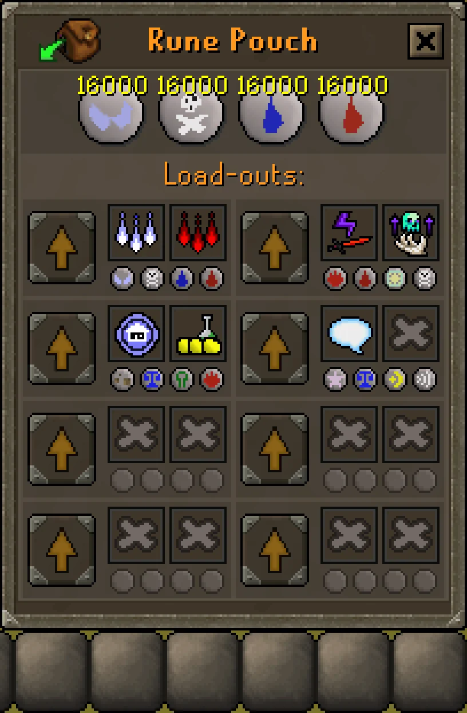

# Better Rune Loadouts

[](https://paypal.me/camjewell)

A [RuneLite](https://runelite.net/) plugin that redesigns the rune pouch's
Load-outs popup — opened by clicking the pouch while the bank is open — from
vanilla's single-column list of buttons into a compact 2-column icon grid.
Each loadout gets a custom name, a pair of custom theme icons, and a clear
readout of the runes (and saved quantities) it will load.

| Original mockup | Current implementation |
| --- | --- |
|  |  |

Credit to SheeplerSN on reddit for the mockup this plugin is built from.

## Features

- **10 loadout slots (A–J)** in a scrollable 2-column grid, up from vanilla's
  single column.
- **Custom names** — click a loadout's name to rename it (up to 15
  characters).
- **Custom theme icons** — right-click a loadout for a Rename / Change Icon /
  Reset menu, or click either icon slot directly. Icons are picked from a
  searchable catalog covering spellbook, skilling, and boss icons.

  

- **Compact rune display** — each loadout's actual saved runes are shown as
  a small icon row instead of vanilla's clipped, overlapping icons. Clicking
  a rune icon opens the real vanilla rune picker to change it.
- **Quantity in hover text** — hovering a rune shows its saved quantity when
  one is set (nothing shown for "All"/unlimited).

  

- **Native hover/load behavior preserved** — hovering a Load button still
  shows the loadout's name, and clicking it loads exactly as vanilla does.

  

- **Regular (3-slot) rune pouch support** — if a loadout has a 4th rune
  saved from when a divine pouch was equipped, it's shown greyed out and
  non-interactive rather than implying it can still be loaded. The data
  isn't lost — it reappears fully usable if a divine pouch is re-equipped
  later.

## Building

Requires a JDK compatible with RuneLite's `example-plugin` template (Java 11 target).

```bash
./gradlew shadowJar   # Build the plugin JAR
./gradlew run         # Launch a RuneLite dev client with the plugin loaded
./gradlew test        # Run tests
```

`./gradlew run` launches an unauthenticated development client — log in via a
[Jagex account](https://github.com/runelite/runelite/wiki/Using-Jagex-Accounts) to test in-game.

## License

BSD-2-Clause — see [LICENSE](LICENSE).
